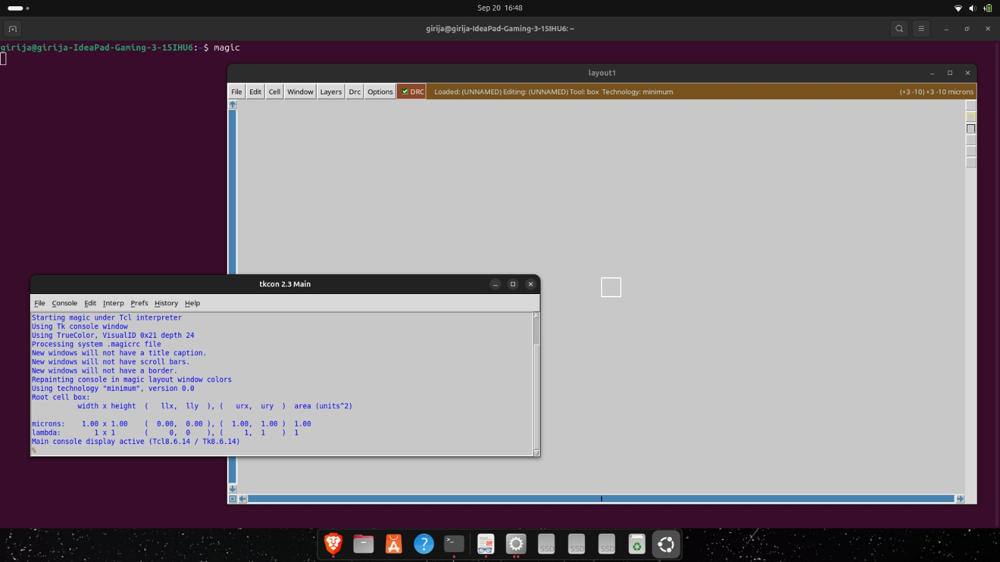

# ⚡ VLSI Open-Source EDA Tools Setup

This repository contains the **setup, configuration, and verification** of open-source **EDA tools** that power digital and analog SoC design.  
The goal is to create a ready-to-use environment for RTL design, simulation, synthesis, and physical design.

---

## 🔧 Installed Tools & Purpose

| 🛠️ Tool | 💡 Why It’s Used | 🔍 Verification | 
|---------|------------------|-----------------|
|   | Logic synthesis (convert RTL → gate-level netlist). | `yosys -V` |
|    | Verilog simulation & functional verification. | `iverilog -V` |
|    | View waveforms from simulation (`.vcd` files). | `gtkwave --version` | 
|    | Analog & mixed-signal SPICE-level simulation. | `ngspice -v` | 
|    | Layout editor for VLSI design. | `magic -version` |
|    | Complete RTL → GDSII flow (synthesis, placement, routing). | `docker --version` <br> `make test` | 

---

# Task 1 – Getting Started with Digital VLSI SoC Design and Planning ✅

- Learned the fundamentals of the VLSI SoC flow.
- Understood RTL → synthesis → planning before silicon.
- Saw how the SoC Labs program aligns with these stages.
- Ready to move toward RTL → GDSII implementation.
---
# Task 2 ⚙️ Setup & Installation

---

## 🖥️ Environment Details
- **OS:** Ubuntu (20.04 LTS onward ) 🐧  
- **CPU:** 4 vCPUs  
- **RAM:** 6 GB  
- **Disk:** 50 GB HDD  

---
## 🛠️Commands For Installation

### 1. Yosys ✅
```bash
sudo apt-get update
git clone https://github.com/YosysHQ/yosys.git
cd yosys
sudo apt install make   # if not already installed
sudo apt-get install build-essential clang bison flex \
    libreadline-dev gawk tcl-dev libffi-dev git \
    graphviz xdot pkg-config python3 libboost-system-dev \
    libboost-python-dev libboost-filesystem-dev zlib1g-dev
make config-gcc
make
sudo make install
```

### 2. Icarus Verilog ✅
```bash
sudo apt-get install iverilog
```
  
### 3. GTKWaves ✅
```bash
sudo apt install gtkwave
```

### 4. Ngspice ✅
```bash
#Download ngspice tarball from: https://sourceforge.net/projects/ngspice/files/
tar -zxvf ngspice-37.tar.gz  # change as per the version you download
cd ngspice-37
mkdir release
cd release
../configure --with-x --with-readline=yes --disable-debug
make
sudo make install
```
 
### 5. Magic ✅
```bash
sudo apt-get install m4
sudo apt-get install tcsh
sudo apt-get install csh
sudo apt-get install libx11-dev
sudo apt-get install tcl-dev tk-dev
sudo apt-get install libcairo2-dev
sudo apt-get install mesa-common-dev libglu1-mesa-dev
sudo apt-get install libncurses-dev
git clone https://github.com/RTimothyEdwards/magic
cd magic
./configure
make
sudo make install
```


### 6. OpenSTA ✅
```bash
https://github.com/The-OpenROAD-Project/OpenSTA #Download using this link
```
---
## 🌟 Highlights
- Verified installation of **six essential open-source EDA tools**.  
- Environment is now ready for **RTL design, simulation, and chip layout workflows**.  
- Documentation can be reused by anyone setting up the same flow.  

---

## 🙌 Credits
A big thanks to:  
- **IIT Gandhinagar**   
- **VSD Team & Kunal Ghosh Sir**   
- The global **Open-Source EDA Community**   

for making VLSI learning accessible and free.

